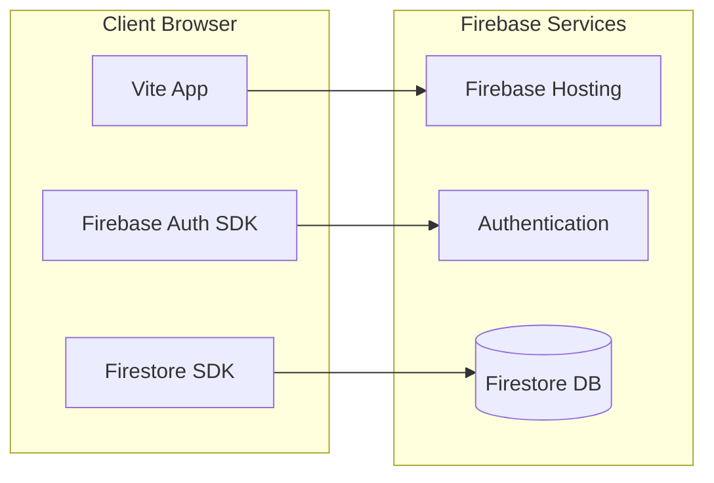

# Firebase Migration Plan

## Architecture Overview



## Phase 1: Firebase Project Setup

1. Create a new Firebase project in the [Firebase Console](https://console.firebase.google.com)
2. Enable **Authentication** with Email/Password provider (add Google/Microsoft later if needed)
3. Create a **Firestore** database (start in production mode)
4. Enable **Hosting**
5. Install Firebase CLI and SDK:
```bash
npm install firebase firebase-tools --save
```


---

## Phase 2: Firestore Schema Design

Since data is shared across all users, use a flat collection structure:

```
/gaugeSheets/{sheetId}
  - id: string
  - name: string
  - lastUpdated: timestamp
  - rawRowCount: number

/gaugeSheets/{sheetId}/wells/{wellId}
  - id: string
  - name: string
  - chemicalProgram: object
  - failureHistory: array
  - actionItems: array
  - pressureReadings: array

/gaugeSheets/{sheetId}/wells/{wellId}/production/{docId}
  - date: timestamp
  - oil: number
  - water: number
  - gas: number

/gaugeSheets/{sheetId}/wells/{wellId}/wellTests/{docId}
  - date: timestamp
  - oil: number
  - water: number
  - gas: number

/gaugeSheets/{sheetId}/batteryProduction/{docId}
  - date: timestamp
  - oil: number
  - water: number
  - gas: number

/gaugeSheets/{sheetId}/runTickets/{docId}
  - date: timestamp
  - ticketNumber: string
  - tank: string
  - volume: number
  - (etc.)
```

---

## Phase 3: Authentication Implementation

### 3.1 Create Firebase config file

Create `src/firebase.js`:

```javascript
import { initializeApp } from 'firebase/app';
import { getAuth } from 'firebase/auth';
import { getFirestore } from 'firebase/firestore';

const firebaseConfig = {
  apiKey: "...",
  authDomain: "...",
  projectId: "...",
  // etc from Firebase Console
};

const app = initializeApp(firebaseConfig);
export const auth = getAuth(app);
export const db = getFirestore(app);
```

### 3.2 Create login UI

Add a login view to `index.html` with email/password form. Create `src/auth.js` to handle:

- Sign in with email/password
- Sign out
- Auth state observer to show/hide app based on auth status

### 3.3 Gate the app

In `main.js`, wrap initialization in an auth state check:

```javascript
import { onAuthStateChanged } from 'firebase/auth';
import { auth } from './firebase.js';

onAuthStateChanged(auth, (user) => {
  if (user) {
    // User is signed in - show app
    initializeApp();
  } else {
    // No user - show login
    showLoginView();
  }
});
```

---

## Phase 4: Migrate Storage to Firestore

### 4.1 Create `src/firestore-storage.js`

Replace the synchronous localStorage pattern with async Firestore operations:

- `loadDataFromStorage()` becomes `loadDataFromFirestore()` - fetches all gaugeSheets and nested data
- `saveDataToStorage()` becomes `saveDataToFirestore(sheetId, data)` - writes sheet data to Firestore

Key changes:

- All data operations become `async/await`
- Need loading states in UI during data fetch
- Consider using Firestore's `onSnapshot` for real-time updates (optional)

### 4.2 Update callers

Files that call storage functions need updates:

- `src/main.js` - initial load
- `src/upload.js` - after parsing Excel files
- `src/edit-modal.js` - after saving edits
- `src/dashboard.js` - cache clearing

### 4.3 Handle async loading

Add loading spinner/state to `main.js` while Firestore data loads on startup.

---

## Phase 5: Security Rules

Create `firestore.rules`:

```javascript
rules_version = '2';
service cloud.firestore {
  match /databases/{database}/documents {
    // Only authenticated users can read/write
    match /gaugeSheets/{document=**} {
      allow read, write: if request.auth != null;
    }
  }
}
```

---

## Phase 6: Firebase Hosting Deployment

### 6.1 Initialize Firebase in project

```bash
firebase login
firebase init
# Select: Hosting, Firestore
# Public directory: dist
# Single-page app: Yes
```

### 6.2 Update build and deploy scripts

In `package.json`:

```json
{
  "scripts": {
    "build": "vite build",
    "deploy": "vite build && firebase deploy"
  }
}
```

### 6.3 Configure `firebase.json`

```json
{
  "hosting": {
    "public": "dist",
    "ignore": ["firebase.json", "**/.*", "**/node_modules/**"],
    "rewrites": [{ "source": "**", "destination": "/index.html" }]
  },
  "firestore": {
    "rules": "firestore.rules"
  }
}
```

---

## Files to Create/Modify

| File | Action | Purpose |

|------|--------|---------|

| `src/firebase.js` | Create | Firebase initialization and exports |

| `src/auth.js` | Create | Authentication logic |

| `src/firestore-storage.js` | Create | Firestore data operations |

| `src/storage.js` | Modify | Import from firestore-storage or deprecate |

| `src/main.js` | Modify | Add auth state handling, async loading |

| `src/upload.js` | Modify | Use async Firestore saves |

| `src/edit-modal.js` | Modify | Use async Firestore saves |

| `src/dashboard.js` | Modify | Async data operations |

| `index.html` | Modify | Add login view HTML |

| `styles.css` | Modify | Add login form styles |

| `firebase.json` | Create | Hosting/Firestore config |

| `firestore.rules` | Create | Security rules |

| `.firebaserc` | Create | Project alias |

---

## Risk Considerations

- **Data Volume**: If production/wellTests arrays are very large, consider pagination or limiting historical data in Firestore
- **Offline Support**: Firestore has offline caching built-in, but you may want to configure it explicitly
- **Migration**: Existing localStorage data won't automatically move to Firestore - consider a one-time migration helper or just re-upload the Excel files